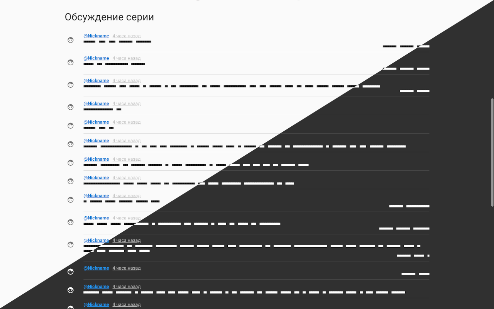

# Play Шикимори Online 
[](https://addons.mozilla.org/ru/firefox/addon/play-shikimori/reviews/)
[](https://addons.mozilla.org/ru/firefox/addon/play-shikimori)


 | 
--- | --- 
 | 

Это браузерное расширение, которое позволяет вам смотреть аниме онлайн и синхронизировать его с вашим списком на Шикимори.


## [Установка](https://github.com/cawa-93/play-shikimori-online/wiki/%D0%98%D0%BD%D1%81%D1%82%D1%80%D1%83%D0%BA%D1%86%D0%B8%D1%8F-%D0%BF%D0%BE-%D1%83%D1%81%D1%82%D0%B0%D0%BD%D0%BE%D0%B2%D0%BA%D0%B5)

## Возможности

В разработке этого расширения основной упор делается непосредственно на онлайн просмотре и всего что с ним связано. Моя цель — сделать его настолько удобным, насколько это возможно.

* Вам не нужно регистрироваться чтобы смотреть аниме онлайн.
* Новые серии добавляются в тот же миг, как они появляются на хостинге-видео. 
* Плеер умеет самостоятельно переключаться на следующую серию, когда текущая подходит к концу.
* Плеер запоминает время, на котором вы остановили просмотр серии, и возобновляет воспроизведение с этого же места.
* Вы можете начать просмотр серии на одном устройстве, а продолжить на другом. Время на котором вы остановились синхронизируется между всеми вашими устройствами
* Ведётся учет в каком переводе вы смотрите. Благодаря этому, когда вы открываете новый сериал, доступен более интелектуальный выбор переводов на основе всех ваших предпочтений.

## [Ответы на возникающие вопросы](https://github.com/cawa-93/play-shikimori-online/wiki/FAQ)


## [Дорожная карта](https://github.com/cawa-93/play-shikimori-online/projects/1)

## Contributing
Pull requests are welcome. For major changes, please open an issue first to discuss what you would like to change.

### Project setup
```
npm install
```

### Environments
```bash
# Setup environment
NODE_ENV=production
BROWSER=chrome # or firefox

# Shikimori oauth
SHIKIMORI_REDIRECT_URI=
SHIKIMORI_CLIENT_ID=
SHIKIMORI_CLIENT_SECRET=
```

### Compiles for development
```
npm run build:dev
```

### Compiles and minifies for production
```
npm run build
```

### Run your tests
```
npm run test
```

### Lints and fixes files
```
npm run lint
```

### Run your end-to-end tests
```
npm run test:e2e
```

### Run your unit tests
```
npm run test:unit
```

### Customize configuration
See [Configuration Reference](https://cli.vuejs.org/config/).


## License
[GPL-3.0](https://github.com/cawa-93/play-shikimori-online/blob/master/LICENSE)
